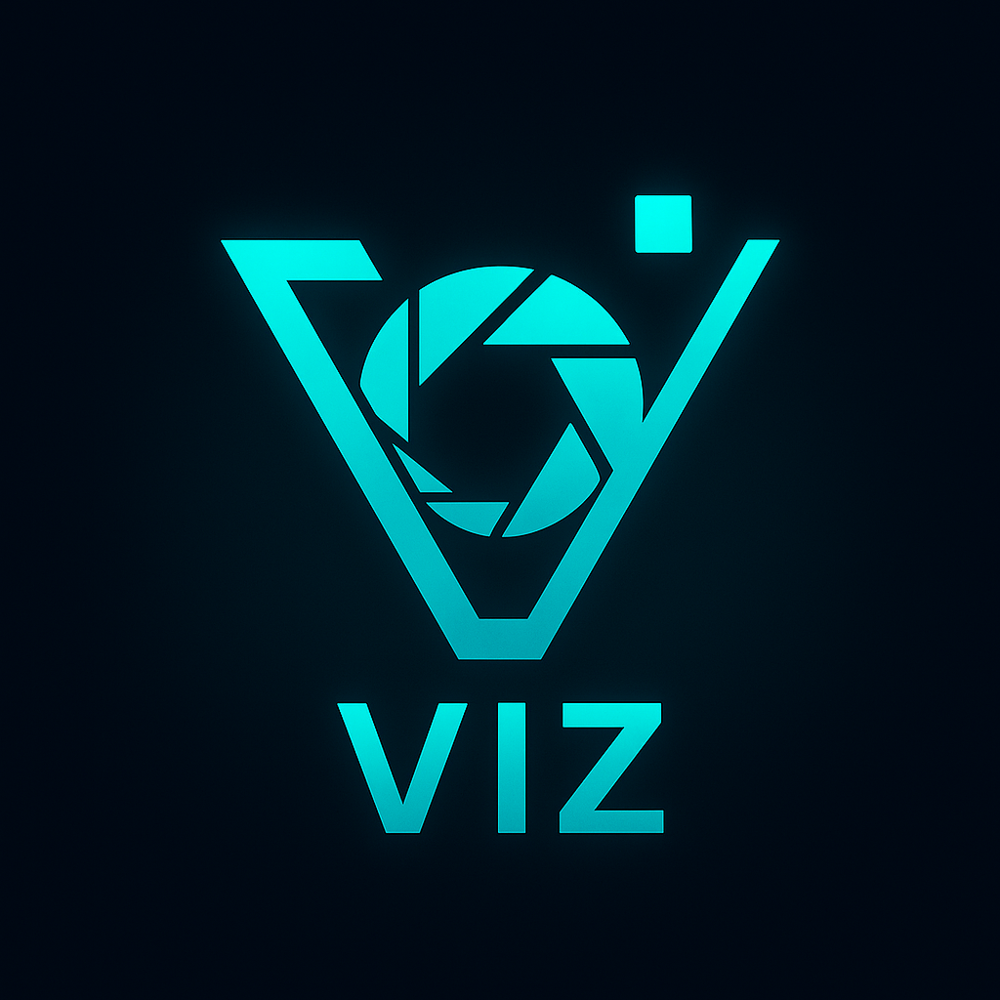

# 🖼️ VIZ — The Vision Engine for Zig

<div align="center">
  
</div>

[](https://ziglang.org)
[](https://developer.nvidia.com/)
[](LICENSE)

**VIZ** (short for *Vision*) is a modern, GPU-accelerated image processing toolkit written in **Zig**,  
designed as a high-performance, memory-safe alternative to ImageMagick and GraphicsMagick — built for Linux.

---

## ✨ Philosophy

> Minimal, predictable, and *blazingly fast*.  
> No dependency hell, no runtime magic — just pure Zig performance.

VIZ redefines the classic image manipulation pipeline with a **compile-time typed core**,  
**deterministic SIMD/GPU kernels**, and **zero-copy pipelines** that scale from CLI tools to native apps.

---

## 🚀 Key Features

### 🧱 Modern Image Stack
- Written 100% in **Zig** — no C shims or legacy wrappers.
- Fully modular pipeline: `decode → transform → render → export`.
- Compatible with `.png`, `.jpg`, `.tiff`, `.webp`, `.bmp`, `.hdr`, and more.

### ⚡ GPU-Accelerated Processing
- **CUDA** and **Vulkan compute backend** for real-time filters and transformations.
- Automatic CPU/GPU fallback for headless servers.
- Supports NVIDIA, AMD, and Intel GPUs (through modular backends).

### 🔮 Typed Effects & Filters
- Pure-Zig API for chaining filters at compile-time:
  ```zig
  const viz = @import("viz");
  const image = try viz.open("photo.png");
  const result = image
      .blur(3.5)
      .brightness(1.2)
      .contrast(0.9)
      .export("output.webp");
```

---

## 🔗 Integrations

| Tool    | Purpose                          |
|---------|----------------------------------|
| Babylon | Package & provenance management  |
| ZIM     | Toolchain control                |
| Apollo  | Telemetry, performance, metrics  |
| ZMake   | Build orchestration              |

---

## 🧬 Architecture

```
┌────────────────────────┐
│        VIZ CLI         │
│    (zig build run)     │
└────────────┬───────────┘
             │
     ┌───────▼────────┐
     │   Core Engine  │  →   Image Ops, Color, Geometry
     └───────┬────────┘
             │
     ┌───────▼────────┐
     │  GPU Backend   │  →   CUDA / Vulkan / CPU Fallback
     └───────┬────────┘
             │
     ┌───────▼────────┐
     │   Exporters    │  →   PNG, JPEG, WebP, HDR, BMP
     └────────────────┘
```

---

## 🧩 Roadmap

- [ ] SIMD-optimized CPU filters (AVX2, NEON)
- [ ] Vulkan compute kernel support
- [ ] Native integration with Archon (GPU context sharing)
- [ ] Support for animated WebP/GIF
- [ ] Scripting bindings (Python / Zig API)
- [ ] Live preview + GUI toolkit plugin

---

## 🧰 Build & Run

### Requirements

- Zig ≥ 0.16.0
- (Optional) NVIDIA CUDA toolkit for GPU acceleration

### Installation

```bash
git clone https://github.com/ghostkellz/viz.git
cd viz
zig build run -- --help
```

---

## 💡 Vision

VIZ is the visual layer of the GhostStack ecosystem — a foundation for high-performance rendering, visualization, and generative media tools built entirely in Zig.

> "VIZ is not just faster ImageMagick — it's what ImageMagick would have been if it were born in 2025."

---

## 🪶 License

MIT © 2025 Christopher Kelley (GhostKellz)

